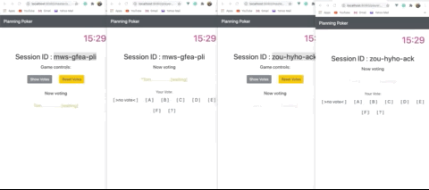

# About Planning Pocker 🌄

A project buidling

## Installation

```bash
yarn install
cd client
yarn install
```

##Run on localhost
To Start the server

```bash
yarn serve
```

To Start the front-end

```bash
cd client
yarn serve
```

##Demo

<p align="center">
  
</p>

<p align="center">
  
</p>

##Customization
Under root folder, there is a file called cardDeck.js where you can put your vote options.
